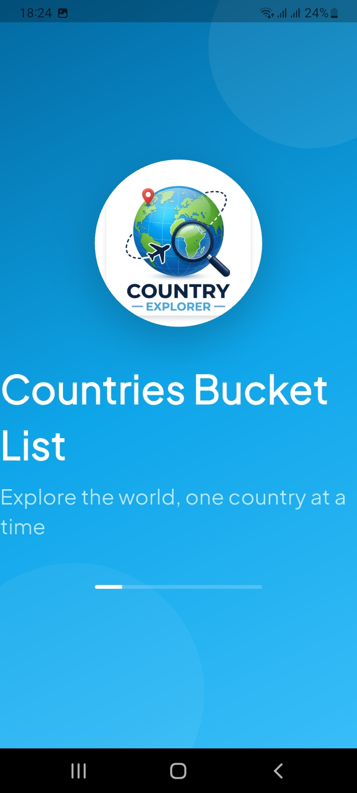
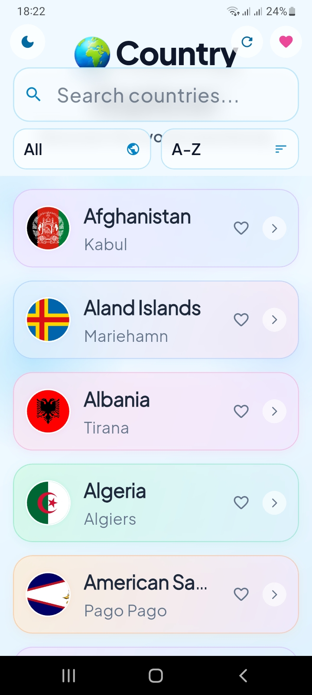
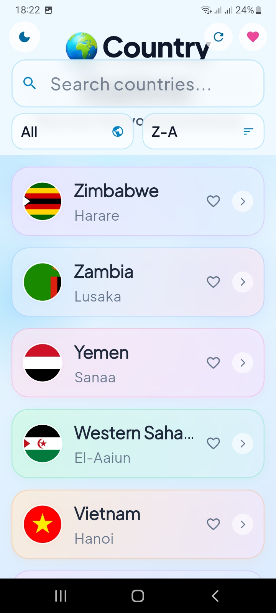
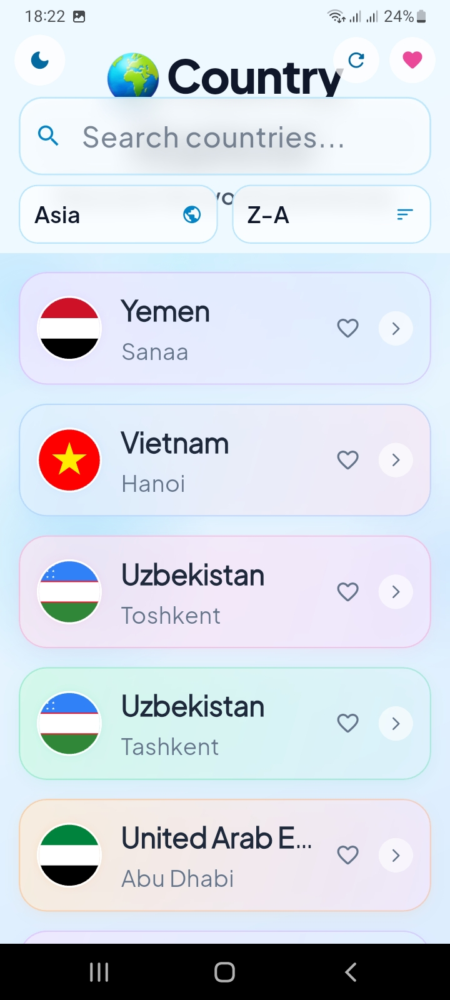
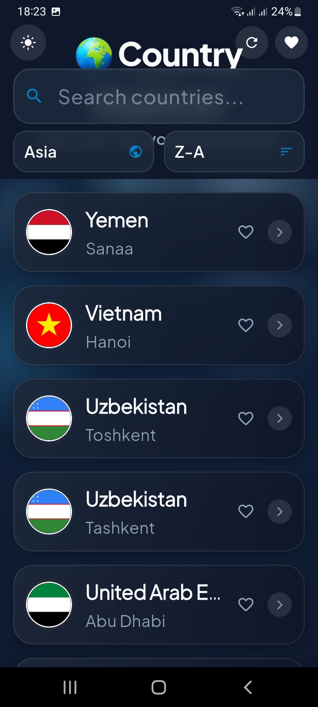
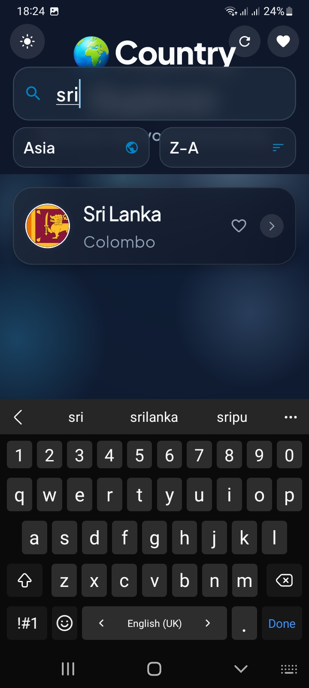
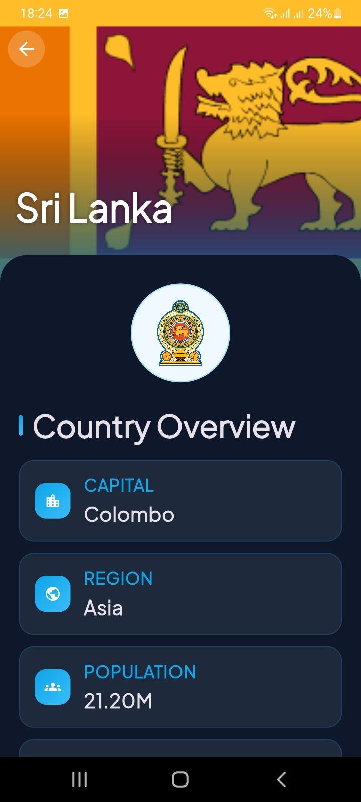
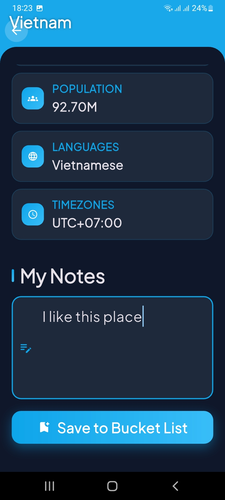
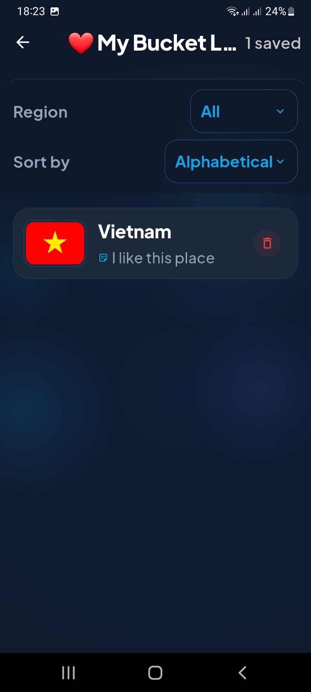

# Countries Bucket List

## 1. Project Description

Countries Bucket List is a Flutter application for exploring countries and building a personal travel bucket list. Users can browse countries, search and filter them by region, view country details, and save destinations with personal notes. The app also supports a local bucket list and offline-friendly data loading.

### Key features
- Browse countries from a public API
- Search, filter, and sort the country list
- View detailed country information such as capital, region, population, languages, and timezones
- Save countries to a personal bucket list with notes
- Persist saved items locally on the device
- Use fallback JSON data for missing country information

## 2. Instructions to Run

### Prerequisites
- Flutter SDK installed
- Android Studio, VS Code, or another Flutter-compatible editor
- An emulator or physical device

### Steps
1. Clone the repository.
2. Open the project folder in your terminal.
3. Install dependencies:

```bash
flutter pub get
```

4. Run the app:

```bash
flutter run
```

### Optional build commands
```bash
flutter build apk
flutter build appbundle
flutter build web
```

## 3. State Management Explanation

This app uses Flutter Riverpod for state management.

- The app creates providers for shared state such as theme mode, search queries, selected region, and sort order.
- Country data is managed through providers that fetch data from the API, cache it, and expose filtered results to the UI.
- Bucket list state is handled separately so users can add, update, remove, and filter saved countries without directly coupling UI screens to storage logic.

### Main provider roles
- `countriesProvider`: loads and caches country data
- `filteredCountriesProvider`: applies search, region, and sorting logic
- `pagedCountriesProvider`: provides visible items for pagination/infinite scrolling
- `bucketListProvider`: manages saved countries and notes
- `sortedBucketListProvider`: applies bucket list filters and sort rules

## 4. Architecture Overview

The project follows a simple layered architecture:

- `lib/screens/`: UI screens such as splash, home, details, and bucket list
- `lib/controllers/`: Riverpod providers and state-notifier logic
- `lib/api/`: API communication layer
- `lib/db/`: local persistence using SharedPreferences
- `lib/models/`: app data models
- `lib/services/`: helpers for region, language, and timezone mapping
- `lib/widgets/`: reusable UI components
- `lib/main.dart`: app entry point and app setup

This structure keeps UI, state, networking, and storage responsibilities separated, making the app easier to maintain and extend.


Screenshots








